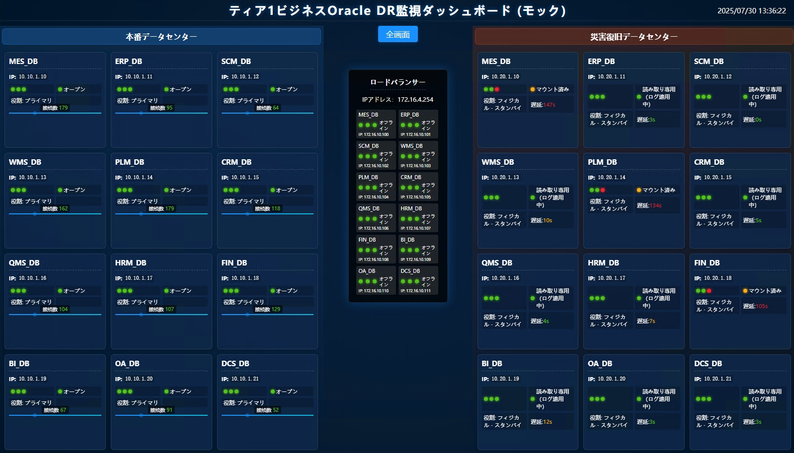

# Oracle データベースDR監視ダッシュボード

> **他の言語:** [English](README.md) | [中文](README-zh.md)

## 概要

GoとGinフレームワークで開発された、軽量で高可用性なOracleデータベースのヘルスモニタリングと可視化プラットフォームです。エンタープライズレベルのOracle Data Guard環境に統一されたヘルスモニタリングと視覚的管理機能を提供し、Webダッシュボードを通じてプライマリ/スタンバイデータベースのステータスや同期遅延などの主要なメトリクスをリアルタイムに表示し、運用チームがデータベースの運用状態を効率的に管理するのを支援します。

## 主な機能

- **リアルタイム監視**: プライマリデータベース、スタンバイデータベース、ロードバランサーノードのステータスをリアルタイムに表示します。
- **マルチインスタンス対応**: 設定ファイルを通じて複数のOracleデータベースインスタンスを監視できます。
- **多言語インターフェース**: 中国語、英語、日本語のインターフェースを動的に切り替えられます。
- **コマンドラインサポート**: 設定ファイルの指定やバージョン確認などのコマンドラインパラメータを提供します。
- **高いカスタマイズ性**: `config.yaml` を通じて、データベース接続、UIタイトル、更新間隔などを柔軟に設定できます。
- **非常にシンプルなデプロイ**: 外部依存関係のない単一のバイナリファイルにコンパイルでき、サービスとして、またはDockerで実行できます。
- **RESTful API**: 二次開発やシステム統合のための `/api/data` などのデータインターフェースを提供します。
- **モックデータモード**: フロントエンド開発とテストのための独立したモックデータ機能を内蔵しています（[モックデータガイド](MOCK_GUIDE.md) を参照）。

## 技術スタック

- **バックエンド**: Go, Gin
- **フロントエンド**: バニラJavaScript, HTML, CSS
- **設定**: YAML

## クイックスタート

### 1. 前提条件

- Go 1.18 以降

### 2. リポジトリのクローン

```bash
git clone https://github.com/goodwaysIT/go-oracle-dr-dashboard.git
cd go-oracle-dr-dashboard
```

### 3. 実行モード

#### 標準モード（実際のデータベースに接続）

1. **`config.yaml` を設定**: Oracle環境に合わせてデータベース接続情報を変更します。
2. **実行**:
   ```bash
   go run .
   ```

## 主な機能

### コマンドライン引数

アプリケーションは以下のコマンドライン引数をサポートしています：

- `-f`, `--file <パス>`: 設定ファイルのパスを指定します（デフォルト: `config.yaml`）。
- `-v`, `--version`: アプリケーションの現在のバージョンを表示します。
- `-h`, `--help`: ヘルプ情報を表示します。

**例**:
```bash
go run . -f /etc/dashboard/prod.yaml
```

### 多言語サポート

URLに `lang` パラメータを追加することで、インターフェースの言語を動的に切り替えることができます。

- **英語**: `http://localhost:8080/?lang=en`
- **中国語**: `http://localhost:8080/?lang=zh`
- **日本語**: `http://localhost:8080/?lang=ja`

## 設定ファイル (`config.yaml`)

アプリケーションのさまざまなパラメータをカスタマイズできます。以下に主要な設定例を示します：

```yaml
# UIタイトル設定
titles:
  main_title: "OracleデータベースDR監視ダッシュボード"
  prod_data_center: "本番データセンター"
  dr_data_center: "災害復旧データセンター"

# レイアウト設定
layout:
  columns: 3  # データセンターごとに表示するデータベースの列数
```

これらの設定は、アプリケーションの実行時に有効になります（モックモード以外）。

## デプロイガイド

Goの機能により、このプロジェクトは外部依存関係のない単一のバイナリファイルにコンパイルでき、デプロイプロセスが大幅に簡素化されます。

### 1. 実行可能ファイルへのコンパイル

さまざまなオペレーティングシステム向けに実行可能ファイルをコンパイルできます。

**現在のシステム用:**
```bash
go build -o oracle-dr-dashboard .
```

**Linux用にクロスコンパイル:**
```bash
GOOS=linux GOARCH=amd64 go build -o oracle-dr-dashboard_linux .
```

コンパイル後、生成された実行可能ファイル（例：`oracle-dr-dashboard_linux`）と `config.yaml` 設定ファイルをサーバーにコピーするだけで実行できます。

### 2. Linuxサービスとして実行

Linuxシステムでは、`systemd` を使用してアプリケーションを管理し、自動起動と安定した動作を実現することをお勧めします。

1. **`systemd` サービスファイルを作成** `/etc/systemd/system/dashboard.service`:

   ```ini
   [Unit]
   Description=Oracle DR Dashboard Service
   After=network.target

   [Service]
   Type=simple
   User=your_user          # サービスを実行するユーザーに置き換えてください
   WorkingDirectory=/opt/dashboard  # アプリケーションディレクトリに置き換えてください
   ExecStart=/opt/dashboard/oracle-dr-dashboard_linux -f /opt/dashboard/config.yaml
   Restart=on-failure
   RestartSec=5s

   [Install]
   WantedBy=multi-user.target
   ```

2. **サービスをリロードして起動**:
   ```bash
   sudo systemctl daemon-reload
   sudo systemctl start dashboard
   sudo systemctl enable dashboard  # システム起動時に自動起動するように設定
   ```

### 3. Dockerで実行

環境の分離と迅速なデプロイのために、Dockerを使用してアプリケーションをコンテナ化することもできます。

1. **`Dockerfile` を作成**:

   ```dockerfile
   # --- ビルドステージ ---
   FROM golang:1.18-alpine AS builder
   WORKDIR /app
   COPY . .
   RUN go build -o /oracle-dr-dashboard .

   # --- 最終ステージ ---
   FROM alpine:latest
   WORKDIR /app
   COPY --from=builder /oracle-dr-dashboard .
   COPY config.yaml .

   EXPOSE 8080
   CMD ["./oracle-dr-dashboard", "-f", "config.yaml"]
   ```

2. **Dockerイメージをビルドして実行**:
   ```bash
   docker build -t oracle-dr-dashboard .
   docker run -p 8080:8080 -d --name dashboard oracle-dr-dashboard
   ```

## スクリーンショット

#### 日本語インターフェース


## 技術スタック
- Webフレームワーク: [Gin](https://github.com/gin-gonic/gin)
- 設定解析: gopkg.in/yaml.v3
- ロギング: 標準ライブラリ log + オプションのlogrotate
- フロントエンド: 静的HTML/CSS/JS（カスタマイズ可能）
- 実行環境: Windows/Linux対応

## 使い方
1. 設定ファイル `config.yaml` を準備します（以下の例とフィールド説明を参照）。
2. 実行可能ファイルと設定ファイルを同じディレクトリに配置します。
3. サービスを起動します：
   ```shell
   ./oracle-dr-dashboard
   ```
   またはWindowsの場合：
   ```shell
   oracle-dr-dashboard.exe
   ```
4. Webダッシュボードにアクセスします：
   ブラウザで `http://<サーバーIP>:8080/` を開きます（ポート番号は設定ファイルで変更可能）。
5. ログは `oracle-dr-dashboard.log` に出力されます。

## 設定ファイルの詳細 (config.yaml)

```yaml
# サーバー設定
server:
  port: "8080"                   # Webサービスのリッスンポート
  static_dir: "./static"         # 静的リソースディレクトリ（オプション）
  refresh_interval: 60           # データの更新間隔（秒）
  public_base_path: "/"         # フロントエンドのベースパス（サブパスにデプロイする場合に変更）

# ロギング設定
logging:
  level: "info"                 # ログレベル（info/debug/warn/error）
  filename: "oracle-dr-dashboard.log"  # ログファイル名
  max_size_mb: 100              # 単一ログファイルの最大サイズ（MB）
  max_backups: 5                # ログファイルの最大バックアップ数
  max_age_days: 30              # ログの最大保持日数

# データベース設定
# 複数のデータベースインスタンスを以下のように設定できます：
databases:
  - name: "コアデータベース"
    lb_ip: "192.168.1.101"
    prod_ip: "10.0.1.101"
    dr_ip: "10.1.1.101"
    port: 1521
    service_name: "ORCLPDB1"
    username: "monitor_user"
    password: "your_secure_password_here"
  # ...（追加のデータベース設定を追加可能）
```

### フィールド説明
- `server.port`: Webサービスのリッスンポート。
- `server.static_dir`: 静的リソースディレクトリ、デフォルトは `./static` で、ビルドに埋め込むことができます。
- `server.refresh_interval`: フロントエンドの自動更新間隔（秒）。
- `server.public_base_path`: リバースプロキシやサブパスデプロイに適したフロントエンドのベースパス。
- `logging`: ロギング関連の設定。
- `databases`: 複数のインスタンスをサポートするデータベースインスタンスのリスト。

## 例

1. サービスを起動：
   ```shell
   ./oracle-dr-dashboard
   ```
2. Webインターフェースにアクセス：
   - ブラウザで `http://localhost:8080/` またはサーバーの実際のIPを開く
3. 複数のデータベースを設定するには、設定ファイルの `databases` に追加するだけです。

## ビルドとクロスコンパイル

### ローカルビルド
```shell
go build -o oracle-dr-dashboard main.go config.go logger.go status.go
```

### クロスコンパイル（例：Linux）
```shell
GOOS=linux GOARCH=amd64 go build -o oracle-dr-dashboard main.go config.go logger.go status.go
```

### クロスコンパイル（例：Windows）
```shell
GOOS=windows GOARCH=amd64 go build -o oracle-dr-dashboard.exe main.go config.go logger.go status.go
```

## 注意事項
- 監視対象のデータベースがネットワーク的に到達可能で、アカウントに適切な権限があることを確認してください。
- 静的リソースはカスタマイズ可能で、デフォルトのディレクトリは `./static` です。
- サブパスにデプロイする場合は、`public_base_path` を設定してください。
- システム監視と組み合わせて、バックグラウンドサービスとして実行することをお勧めします。

## ライセンス
[MIT](LICENSE)

---
さらにヘルプが必要な場合は、プロジェクトの[GitHubリポジトリ](https://github.com/goodwaysIT/go-oracle-dr-dashboard)にアクセスするか、開発者までお問い合わせください。
