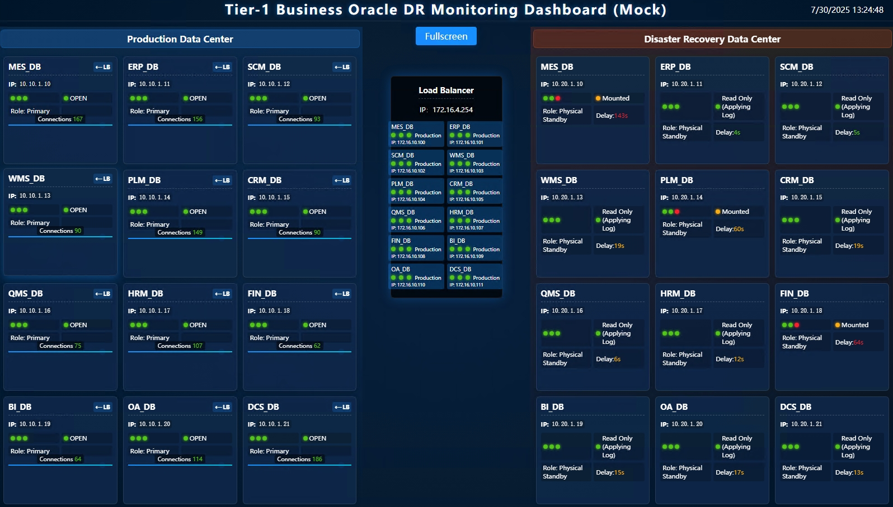

# Oracle 数据库容灾监控大盘

## 简介

一款基于 Go 和 Gin 框架开发的轻量级、高可用的 Oracle 数据库健康监控与可视化平台。它为企业级 Oracle Data Guard 环境提供统一的健康监控与可视化管理能力，通过 Web 仪表盘实时展现主备库状态、同步延迟等核心指标，助力运维团队高效掌控数据库运行状态。

## 功能亮点

- **实时监控**：实时展示主库、备库、负载均衡节点状态。
- **多实例支持**：通过配置文件支持监控多个 Oracle 数据库实例。
- **多语言界面**：支持中文、英文、日文界面动态切换。
- **命令行支持**：提供命令行参数，支持指定配置文件、查看版本等。
- **高可定制化**：通过 `config.yaml` 可灵活配置数据库连接、UI标题、刷新率等。
- **部署极其简单**：可编译为单个二进制文件，无外部依赖，支持作为服务或在 Docker 中运行。
- **RESTful API**：提供 `/api/data` 等数据接口，便于二次开发与系统集成。
- **模拟数据模式**：内置独立的模拟数据功能，方便前端开发与测试 (详见 [模拟数据指南](MOCK_GUIDE.md))。

## 技术栈

- **后端**：Go, Gin
- **前端**：Vanilla JavaScript, HTML, CSS
- **配置**：YAML

## 快速上手

### 1. 环境准备

- Go 1.18 或更高版本

### 2. 克隆项目

```bash
git clone https://github.com/goodwaysIT/go-oracle-dr-dashboard.git
cd go-oracle-dr-dashboard
```

### 3. 运行模式

#### 标准模式（连接真实数据库）

1.  **配置 `config.yaml`**：根据您的 Oracle 环境修改数据库连接信息。
2.  **运行**：
    ```bash
    go run .
    ```


## 核心功能详解

### 命令行参数

应用支持以下命令行参数：

- `-f`, `--file <path>`：指定配置文件的路径 (默认为 `config.yaml`)。
- `-v`, `--version`：显示当前应用的版本号。
- `-h`, `--help`：显示帮助信息。

**示例**：
```bash
go run . -f /etc/dashboard/prod.yaml
```


### 多语言支持

通过在 URL 中添加 `lang` 参数，可以动态切换界面语言。

- **英文**：`http://localhost:8080/?lang=en`
- **中文**：`http://localhost:8080/?lang=zh`
- **日文**：`http://localhost:8080/?lang=ja`


## 配置文件 (`config.yaml`)

您可以自定义应用的各项参数，例如 UI 标题和布局。下面是一些关键配置项的示例：

```yaml
# UI 标题配置
titles:
  main_title: "一级业务Oracle容灾监控大盘"
  prod_data_center: "生产数据中心"
  dr_data_center: "容灾数据中心"

# 布局配置
layout:
  columns: 3  # 每个数据中心默认显示的数据库列数
```

这些配置将在应用运行时（非模拟模式）生效。

## 部署指南

得益于 Go 语言的特性，本项目可以被编译成一个无任何外部依赖的二进制文件，极大地简化了部署流程。

### 1. 编译为可执行文件

你可以为不同的操作系统编译可执行文件。

**为当前系统编译：**
```bash
go build -o oracle-dr-dashboard .
```

**交叉编译为 Linux 版本：**
```bash
GOOS=linux GOARCH=amd64 go build -o oracle-dr-dashboard_linux .
```

编译后，只需将生成的可执行文件（例如 `oracle-dr-dashboard_linux`）和 `config.yaml` 配置文件一同拷贝到服务器上即可运行。

### 2. 作为 Linux 服务运行

在 Linux 系统上，推荐使用 `systemd` 来管理应用，以实现开机自启和稳定运行。

1.  **创建一个 `systemd` 服务文件** `/etc/systemd/system/dashboard.service`：

    ```ini
    [Unit]
    Description=Oracle DR Dashboard Service
    After=network.target

    [Service]
    Type=simple
    User=your_user          # 替换为运行服务的用户
    WorkingDirectory=/opt/dashboard  # 替换为你的应用目录
    ExecStart=/opt/dashboard/oracle-dr-dashboard_linux -f /opt/dashboard/config.yaml
    Restart=on-failure
    RestartSec=5s

    [Install]
    WantedBy=multi-user.target
    ```

2.  **重载并启动服务**：
    ```bash
    sudo systemctl daemon-reload
    sudo systemctl start dashboard
    sudo systemctl enable dashboard  # 设置开机自启
    ```

### 3. 使用 Docker 运行

你也可以使用 Docker 将应用容器化，实现环境隔离和快速部署。

1.  **创建一个 `Dockerfile`**：

    ```dockerfile
    # --- Build Stage ---
    FROM golang:1.18-alpine AS builder
    WORKDIR /app
    COPY . .
    RUN go build -o /oracle-dr-dashboard .

    # --- Final Stage ---
    FROM alpine:latest
    WORKDIR /app
    COPY --from=builder /oracle-dr-dashboard .
    COPY config.yaml .

    EXPOSE 8080
    CMD ["./oracle-dr-dashboard", "-f", "config.yaml"]
    ```

2.  **构建并运行 Docker 镜像**：
    ```bash
    docker build -t oracle-dr-dashboard .
    docker run -p 8080:8080 -d --name dashboard oracle-dr-dashboard
    ```

## 界面截图


#### 中文界面


#### 英文界面


#### 日文界面


## 技术栈
- Web 框架：[Gin](https://github.com/gin-gonic/gin)
- 配置解析：gopkg.in/yaml.v3
- 日志记录：标准库 log + 可选 logrotate
- 前端：静态 HTML/CSS/JS（可自定义）
- 运行环境：支持 Windows/Linux

## 使用方法
1. 准备配置文件 `config.yaml`，详见下方示例和字段说明。
2. 将可执行文件与配置文件放置于同一目录。
3. 启动服务：
   ```shell
   ./oracle-dr-dashboard
   ```
   或在 Windows 下：
   ```shell
   oracle-dr-dashboard.exe
   ```
4. 访问 Web 仪表盘：
   浏览器打开 `http://<服务器IP>:8080/`（端口号可在配置文件中修改）
5. 日志输出见 `oracle-dr-dashboard.log`。

## 配置文件详细介绍（config.yaml）

```yaml
# 服务器配置
server:
  port: "8080"                   # Web 服务监听端口
  static_dir: "./static"         # 静态资源目录（可选）
  refresh_interval: 60            # 数据刷新频率（秒）
  public_base_path: "/"          # 前端 BasePath（部署子路径时修改）

# 日志配置
logging:
  level: "info"                  # 日志级别（info/debug/warn/error）
  filename: "db-dashboard.log"   # 日志文件名
  max_size_mb: 100                # 单日志文件最大容量（MB）
  max_backups: 5                  # 日志文件最大备份数
  max_age_days: 30                # 日志最大保存天数

# 数据库配置
# 可配置多套数据库，字段如下：
databases:
  - name: "核心数据库"
    lb_ip: "192.168.1.101"
    prod_ip: "10.0.1.101"
    dr_ip: "10.1.1.101"
    port: 1521
    service_name: "ORCLPDB1"
    username: "monitor_user"
    password: "your_secure_password_here"
  # ...（可追加多条数据库配置）
```

### 字段说明
- `server.port`：Web 服务监听端口。
- `server.static_dir`：静态资源目录，默认 `./static`，可嵌入编译。
- `server.refresh_interval`：前端自动刷新频率（秒）。
- `server.public_base_path`：前端基础路径，适用于反向代理或子路径部署。
- `logging`：日志相关配置。
- `databases`：数据库列表，支持多实例。

## 示例

1. 启动服务
   ```shell
   ./oracle-dr-dashboard
   ```
2. 访问 Web 页面
   - 浏览器访问 `http://localhost:8080/` 或服务器实际 IP
3. 配置多套数据库时只需在 `databases` 下追加即可。

## 构建与交叉编译

### 本地构建
```shell
go build -o oracle-dr-dashboard main.go config.go logger.go status.go
```

### 交叉编译（示例：Linux 平台）
```shell
GOOS=linux GOARCH=amd64 go build -o oracle-dr-dashboard main.go config.go logger.go status.go
```

### 交叉编译（示例：Windows 平台）
```shell
GOOS=windows GOARCH=amd64 go build -o oracle-dr-dashboard.exe main.go config.go logger.go status.go
```

## 注意事项
- 需确保被监控数据库网络可达，账号权限正确。
- 静态资源可自定义，默认目录为 ./static。
- 部署于子路径下时需设置 public_base_path。
- 建议以后台服务方式运行并结合系统监控。

## License
[MIT](LICENSE)

---
如需更多帮助，请访问项目 [GitHub 仓库](https://github.com/goodwaysIT/go-oracle-dr-dashboard) 或联系开发者。
