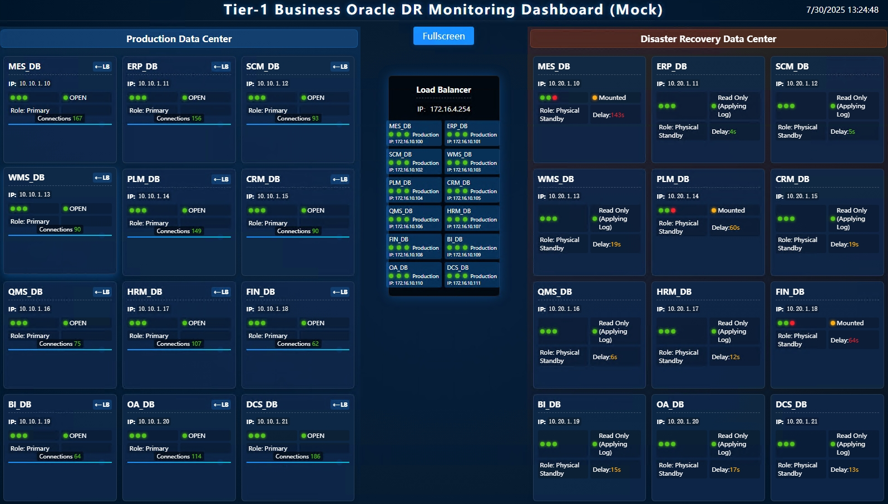

# Oracle Database DR Monitoring Dashboard

> **Other Languages:** [中文](README-zh.md) | [日本語](README-ja.md)

## Introduction

A lightweight, highly available Oracle Database health monitoring and visualization platform developed with Go and the Gin framework. It provides unified health monitoring and visual management capabilities for enterprise-level Oracle Data Guard environments, displaying core metrics such as primary/standby database status and synchronization delay in real-time through a web dashboard, helping operations teams efficiently manage database operations.

## Key Features

- **Real-time Monitoring**: Displays the status of primary database, standby database, and load balancer nodes in real-time.
- **Multi-instance Support**: Supports monitoring multiple Oracle database instances through configuration files.
- **Multilingual Interface**: Supports dynamic switching between Chinese, English, and Japanese interfaces.
- **Command Line Support**: Provides command-line parameters for specifying configuration files, checking version, etc.
- **Highly Customizable**: Flexible configuration of database connections, UI titles, refresh rates, etc., via `config.yaml`.
- **Extremely Simple Deployment**: Can be compiled into a single binary file with no external dependencies, supporting operation as a service or in Docker.
- **RESTful API**: Provides data interfaces like `/api/data` for secondary development and system integration.
- **Mock Data Mode**: Built-in independent mock data functionality for frontend development and testing (see [Mock Data Guide](MOCK_GUIDE.md)).

## Technology Stack

- **Backend**: Go, Gin
- **Frontend**: Vanilla JavaScript, HTML, CSS
- **Configuration**: YAML

## Quick Start

### 1. Prerequisites

- Go 1.18 or higher

### 2. Clone the Repository

```bash
git clone https://github.com/goodwaysIT/go-oracle-dr-dashboard.git
cd go-oracle-dr-dashboard
```

### 3. Run Modes

#### Standard Mode (Connect to Real Database)

1. **Configure `config.yaml`**: Modify the database connection information according to your Oracle environment.
2. **Run**:
   ```bash
   go run .
   ```

## Core Features

### Command Line Arguments

The application supports the following command-line arguments:

- `-f`, `--file <path>`: Specify the path to the configuration file (default: `config.yaml`).
- `-v`, `--version`: Display the current version of the application.
- `-h`, `--help`: Display help information.

**Example**:
```bash
go run . -f /etc/dashboard/prod.yaml
```

### Multilingual Support

Dynamically switch the interface language by adding the `lang` parameter to the URL.

- **English**: `http://localhost:8080/?lang=en`
- **Chinese**: `http://localhost:8080/?lang=zh`
- **Japanese**: `http://localhost:8080/?lang=ja`

## Configuration File (`config.yaml`)

You can customize various parameters of the application, such as UI titles and layout. Here are some key configuration examples:

```yaml
# UI Title Configuration
titles:
  main_title: "Oracle Database DR Monitoring Dashboard"
  prod_data_center: "Production Data Center"
  dr_data_center: "Disaster Recovery Data Center"

# Layout Configuration
layout:
  columns: 3  # Number of database columns to display per data center
```

These configurations will take effect when the application is running (non-mock mode).

## Deployment Guide

Thanks to Go's features, this project can be compiled into a single binary file with no external dependencies, greatly simplifying the deployment process.

### 1. Compile to an Executable

You can compile executable files for different operating systems.

**For the current system:**
```bash
go build -o oracle-dr-dashboard .
```

**Cross-compile for Linux:**
```bash
GOOS=linux GOARCH=amd64 go build -o oracle-dr-dashboard_linux .
```

After compilation, simply copy the generated executable file (e.g., `oracle-dr-dashboard_linux`) and the `config.yaml` configuration file to your server to run.

### 2. Run as a Linux Service

On Linux systems, it is recommended to use `systemd` to manage the application for automatic startup and stable operation.

1. **Create a `systemd` service file** at `/etc/systemd/system/dashboard.service`:

   ```ini
   [Unit]
   Description=Oracle DR Dashboard Service
   After=network.target

   [Service]
   Type=simple
   User=your_user          # Replace with the user to run the service
   WorkingDirectory=/opt/dashboard  # Replace with your application directory
   ExecStart=/opt/dashboard/oracle-dr-dashboard_linux -f /opt/dashboard/config.yaml
   Restart=on-failure
   RestartSec=5s

   [Install]
   WantedBy=multi-user.target
   ```

2. **Reload and start the service**:
   ```bash
   sudo systemctl daemon-reload
   sudo systemctl start dashboard
   sudo systemctl enable dashboard  # Enable auto-start on boot
   ```

### 3. Run with Docker

You can also containerize the application using Docker for environment isolation and quick deployment.

1. **Create a `Dockerfile`**:

   ```dockerfile
   # --- Build Stage ---
   FROM golang:1.18-alpine AS builder
   WORKDIR /app
   COPY . .
   RUN go build -o /oracle-dr-dashboard .

   # --- Final Stage ---
   FROM alpine:latest
   WORKDIR /app
   COPY --from=builder /oracle-dr-dashboard .
   COPY config.yaml .

   EXPOSE 8080
   CMD ["./oracle-dr-dashboard", "-f", "config.yaml"]
   ```

2. **Build and run the Docker image**:
   ```bash
   docker build -t oracle-dr-dashboard .
   docker run -p 8080:8080 -d --name dashboard oracle-dr-dashboard
   ```

## Screenshots

#### English Interface


## Technology Stack
- Web Framework: [Gin](https://github.com/gin-gonic/gin)
- Configuration Parsing: gopkg.in/yaml.v3
- Logging: Standard library log + optional logrotate
- Frontend: Static HTML/CSS/JS (customizable)
- Runtime Environment: Supports Windows/Linux

## Usage
1. Prepare the configuration file `config.yaml` (see example and field descriptions below).
2. Place the executable file and configuration file in the same directory.
3. Start the service:
   ```shell
   ./oracle-dr-dashboard
   ```
   Or on Windows:
   ```shell
   oracle-dr-dashboard.exe
   ```
4. Access the web dashboard:
   Open `http://<server-ip>:8080/` in your browser (the port can be modified in the configuration file).
5. Logs are output to `oracle-dr-dashboard.log`.

## Configuration File Details (config.yaml)

```yaml
# Server Configuration
server:
  port: "8080"                   # Web service listening port
  static_dir: "./static"         # Static resource directory (optional)
  refresh_interval: 60           # Data refresh interval (seconds)
  public_base_path: "/"         # Frontend base path (modify for subpath deployment)

# Logging Configuration
logging:
  level: "info"                 # Log level (info/debug/warn/error)
  filename: "oracle-dr-dashboard.log"  # Log file name
  max_size_mb: 100              # Maximum size of a single log file (MB)
  max_backups: 5                # Maximum number of log file backups
  max_age_days: 30              # Maximum log retention days

# Database Configuration
# Multiple database instances can be configured as follows:
databases:
  - name: "Core Database"
    lb_ip: "192.168.1.101"
    prod_ip: "10.0.1.101"
    dr_ip: "10.1.1.101"
    port: 1521
    service_name: "ORCLPDB1"
    username: "monitor_user"
    password: "your_secure_password_here"
  # ... (additional database configurations can be added)
```

### Field Descriptions
- `server.port`: Web service listening port.
- `server.static_dir`: Static resource directory, default `./static`, can be embedded in the build.
- `server.refresh_interval`: Frontend auto-refresh interval (seconds).
- `server.public_base_path`: Frontend base path, suitable for reverse proxy or subpath deployment.
- `logging`: Logging-related configurations.
- `databases`: List of database instances, supporting multiple instances.

## Example

1. Start the service:
   ```shell
   ./oracle-dr-dashboard
   ```
2. Access the web interface:
   - Open `http://localhost:8080/` or the server's actual IP in your browser
3. To configure multiple databases, simply append them under `databases` in the configuration file.

## Building and Cross-Compiling

### Local Build
```shell
go build -o oracle-dr-dashboard main.go config.go logger.go status.go
```

### Cross-Compiling (Example: Linux)
```shell
GOOS=linux GOARCH=amd64 go build -o oracle-dr-dashboard main.go config.go logger.go status.go
```

### Cross-Compiling (Example: Windows)
```shell
GOOS=windows GOARCH=amd64 go build -o oracle-dr-dashboard.exe main.go config.go logger.go status.go
```

## Important Notes
- Ensure the monitored databases are network accessible and the account has the correct permissions.
- Static resources can be customized, with the default directory being `./static`.
- When deploying under a subpath, set `public_base_path`.
- It is recommended to run as a background service with system monitoring.

## License
[MIT](LICENSE)

---
For more help, please visit the project [GitHub Repository](https://github.com/goodwaysIT/go-oracle-dr-dashboard) or contact the developers.
